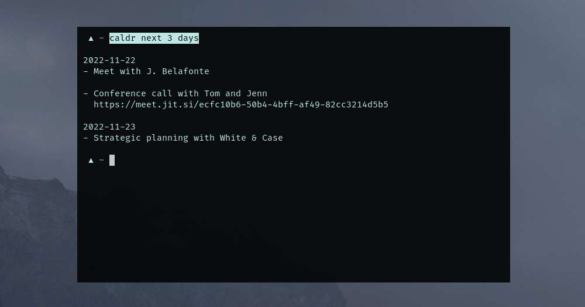

caldr
-----



`caldr`, the command line **cal**en**d**a**r**. It's super lightweight, yet it
supports CardDAV sync!

## Build

```sh
go build .
```

## Usage

Either export all necessary variables to your ENV or set them as command line
flags:

```sh
export CARDDAV_USERNAME='...'
export CARDDAV_PASSWORD='...'
export CARDDAV_ENDPOINT='...'
export CALDR_DB='...'
```

If you're using [Baïkal](https://github.com/sabre-io/Baikal) for example, you
would export something like this as `CARDDAV_ENDPOINT`:

```sh
export CARDDAV_ENDPOINT='https://my.baik.al/dav.php/'
```

The `CALDR_DB` is the local events database in order to not need to contact
the CalDAV for every lookup. You might set it to something like this:

```sh
export CALDR_DB=~/.cache/caldr.db
```

When `caldr` is launched for the first time, it requires the `-r` flag to
refresh the events and sync them locally: 

```sh
caldr -r
```

This way you could create a cron job that refreshes `caldr` in the background,
e.g. every three hours:

```sh
crontab -e
```

```crontab
0 */3 * * * sh -c 'caldr -r'
```

You can also output contacts as JSON format using the `-j` flag:

```sh
caldr -j
```

Find more flags and info with `caldr --help`.


## Templating

You can customize the regular output using templating. The template can either
be passed using the `--template <file>` flag or by exporting `CALDR_TEMPLATE` 
in the in the environment.

The templating format is the [Go standard `text/template`][1] format.

Available property names that are available can be found by checking the 
`CalEvent` struct in `store/store.go`.

An example template can be found [here][2]. To make use of the template, you can
copy it to e.g. `~/.config/caldr.tmpl` and have
`CALDR_TEMPLATE=~/.config/caldr.tmpl` exported in your `.zshrc`/`.bashrc`/etc.


## Notifications

Check my [dotfiles][5], especially [this script][6] for how to get notifications
for events. You could either run this script on login or periodically as a cron 
job.


## FAQ

- Q: Does `caldr` write/modify any contact information?
  A: Nope, so far it's read-only and does not support updating iCals, hence it
     won't mess with your data.
- Q: Can I use it with my local calendar?
  A: Nope, as of right now `caldr` only supports CalDAV servers to sync with.
- Q: Does it support HTTP Digest auth?
  A: Nope, only HTTP Basic auth.
- Q: The `text/template` stuff doesn't work for me, can I make `caldr` output
     contact data differently?
  A: Yes, you can use the `-j` flag and have it output pure JSON, which you can
     then process using e.g. [`jq`][4]. 

[1]: https://pkg.go.dev/text/template
[2]: example.tmpl

[4]: https://stedolan.github.io/jq/
[5]: https://github.com/mrusme/dotfiles
[6]: https://github.com/mrusme/dotfiles/blob/master/usr/local/bin/calendar-notifications
